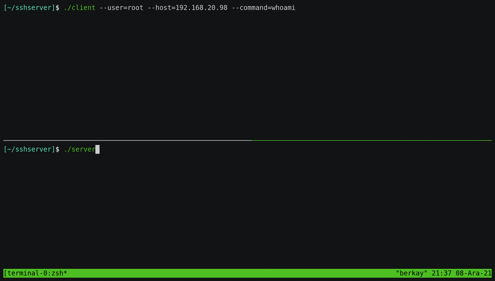

# rpc-ssh

In case, you don't want to make your ssh port accessible from outside local network. This repository helps you to send ssh commands to target machine in your local network from outside via gRPC.

### Usage:
#### Server:
> ./server 
#### Client:
> ./client --server=<server-host> --user=\<ssh-username\> --host=\<ssh-host\> --command=\<command-string\>

### Configuration:

To avoid sending ssh login password via gRPC, there is a yaml configuration file storing passwords and ports.
Here sample:
```yaml
192.168.1.17:
  port: 22
  users:
    berkay: 12345
    mahmut: john123
    root: admin123
192.168.1.18:
  port: 2022
  users:
    root: p@ssw0rd
    admin: n@rut0
```

> **NOTE** this yaml file must be named as 'hosts.yml' and must be located in a directory named config/ which is located in same directory with server executable. 

#### Usage Example:

